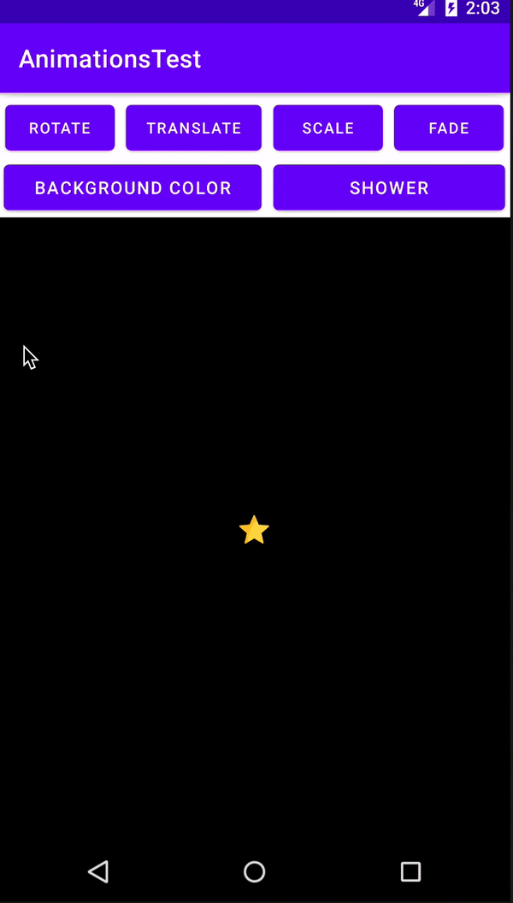

# Animations Test

Basic project of animations in adroid

## Getting Started

Download the project from [Github](https://github.com/RicardoBravoA/AnimationsTest), the updated branch is **master**

### Dependencies

This project uses the following dependencies

- [ConstraintLayout](https://developer.android.com/training/constraint-layout)
- [Navigation Components](https://developer.android.com/guide/navigation/navigation-getting-started)


### Installation

For now it has 2 environments.

```
debug
```

## Testing

For now there are no tests.

## Project Instructions

The project has this features.

<p align="center">
  <br>
</p>

Main
    - Rotate Button
        - Rotate the view for a second around its center once
    - Translate Button
        - Translate the view 200 pixels to the right and back
    - Scale Button
        - Scale the view up to 4x its default size and back
    - Fade Button
        - Fade the view out to completely transparent and then back to completely opaque
    - Colorize Button
        - Animate the color of the star's container from black to red over a half second, then reverse back to black
    - Shower Button
        - A star falls from top to bottom each time the button is pressed      


## License

    Copyright 2020 Ricardo Bravo (Woz).

    Licensed under the Apache License, Version 2.0 (the "License");
    you may not use this file except in compliance with the License.
    You may obtain a copy of the License at

       http://www.apache.org/licenses/LICENSE-2.0

    Unless required by applicable law or agreed to in writing, software
    distributed under the License is distributed on an "AS IS" BASIS,
    WITHOUT WARRANTIES OR CONDITIONS OF ANY KIND, either express or implied.
    See the License for the specific language governing permissions and
    limitations under the License.